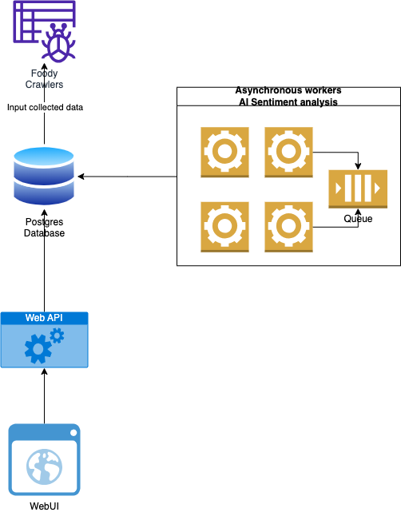

# sentiment-analysis-foody

# Component diagram


# Quickstart Guide

## Step 1 - Prepare your Environment

- Python3.10 (Guideline how to upgrade https://cloudbytes.dev/snippets/upgrade-python-to-latest-version-on-ubuntu-linux)
- Docker or Docker Desktop for Win or MacOs
- Docker Compose

Create the .env file
```yaml
LOG_LEVEL = "INFO"
DB_HOST = "db"
SCRAPY_SPLASH_HOST = "scrapy_splash"
POSTGRES_USER = "postgres"
POSTGRES_PASSWORD = "postgres"
POSTGRES_DB = "sentiment_analysis"
SCHEDULE = "120"
REDIS_URL = "redis://:eYVX7EwVmmxKPCDmwMtyKVge8oLd2t81@cache:6379/0"
```


## Step 2 - Git clone recursive to pull sentiment model

The following commands will clone the sub-modules of sentiment research
```shell
brew install git-lfs # MACOS
# sudo apt install git-lfs # Ubuntu
cd model-research/phobert-base-vietnamese-sentiment
git clone git@hf.co:wonrax/phobert-base-vietnamese-sentiment
```

## Step 3 - Spin up services

The following commands wll use docker-compose to spin up all the follow services:
- scrapy_splash: an extension for Scrapy to use headless browser for login
- crawler: just build image (Due to CPU extensive, we don't recommend to use it in docker)
- cache: Redis
- db: Postgres
- sentiment: AI workere which host model from https://huggingface.co/wonrax/phobert-base-vietnamese-sentiment
- schedule_extraction_beat: worker scheduler
- webapi: the Rest API powered by FastAPI

If it does not work for the 1st time, try to `make down` and run the following commands again
```shell
make all
```

## Step 4 - Run crawler
Update the .env with the following value to make crawler can connect to Database and scrapy splash
```yaml
DB_HOST = "localhost"
SCRAPY_SPLASH_HOST = "localhost"
```

The following commands will run the spider
```shell
cd app/crawler

# Run the bellow in case your default python < 3.10
sudo apt install python3.10-venv
python3.10 -m venv .venv

source .venv/bin/activate

pip install -r requirements.txt

scrapy crawl foody
```

## Step 5 - Review admin dashboard
Browse: http://localhost:3000/

Username: CTV

Password: 1


# Development
## Test
Run unit test (Still in development)

```shell
cd app
chmod +x test_sentiment.sh
./test_sentiment.sh
```

## Run linter
- black
- flake8
- isort

```shell
source .venv/bin/activate
pre-commit run --all-files
```

# Technical debt and improvement
## Technical debt
- Not enough unit test
- CI/CD for smooth integration

## Improvement
- Docker size for worker may be optimized smaller
- Cache model with base class Celery for faster processing
- Production ochestration by k8s
- A Grafana stack for monitoring